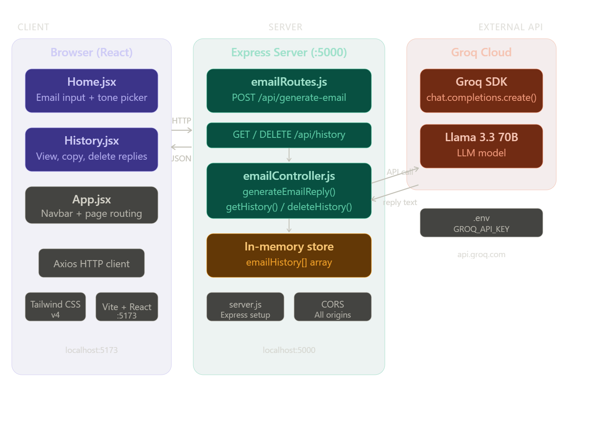
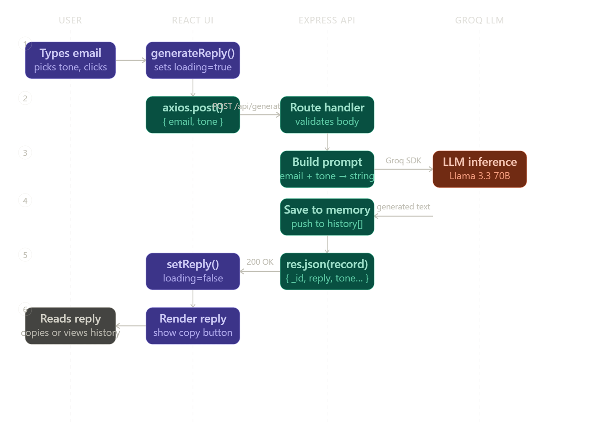
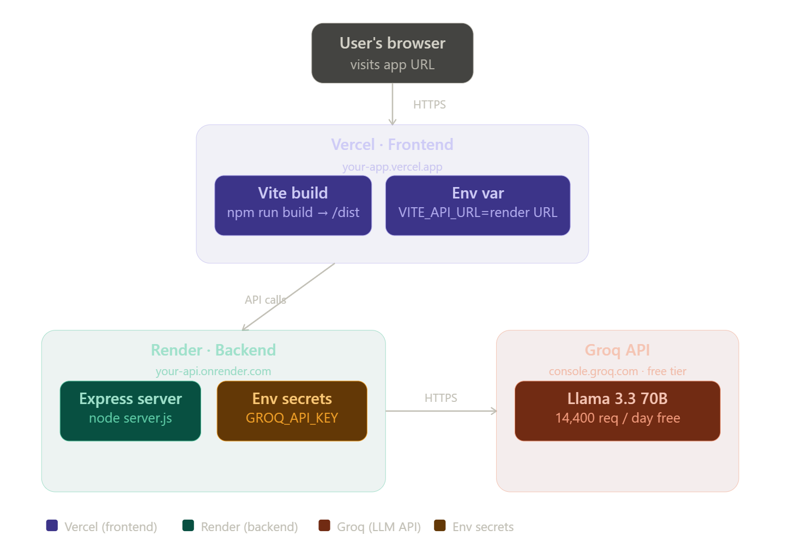

# AI Email Reply Assistant

An AI-powered email reply generator using **Groq** (Llama 3.3 70B). No login required — open for everyone to use.

## Features
- Paste any email and generate a professional reply instantly
- Choose from 6 reply tones: Professional, Friendly, Formal, Confident, Apology, Follow-up
- View session history of generated replies
- Copy replies to clipboard
- No database or login required

## Setup

### 1. Get a Groq API Key
Sign up for free at [console.groq.com](https://console.groq.com) and create an API key.

### 2. Configure the Server
Edit `server/.env`:
```
PORT=5000
GROQ_API_KEY=your_groq_api_key_here
```

### 3. Install & Run the Server
```bash
cd server
npm install
npm start
```
The server runs on **http://localhost:5000**

### 4. Install & Run the Client
```bash
cd client
npm install
npm run dev
```
The client runs on **http://localhost:5173**

## Project Structure
```
ai-email-assistant/
├── client/          # React + Vite + Tailwind CSS frontend
│   └── src/
│       ├── App.jsx
│       └── pages/
│           ├── Home.jsx     # Email generator
│           └── History.jsx  # Session history
└── server/          # Express + Groq backend
    ├── server.js
    ├── controllers/
    │   └── emailController.js
    └── routes/
        └── emailRoutes.js
```

## Notes
- History is stored **in-memory** on the server and resets when the server restarts.
- No database setup required.

Here's a full breakdown of the system design, architecture, and workflow for your AI Email Assistant project.
  

Now the request lifecycle — what happens step by step when a user clicks "Generate Reply":


Now the deployment architecture — how to take the project from local to production:


System design summary
The project is a classic 3-tier web app:
The client (React/Vite on port 5173) is a pure frontend — no business logic, just UI. It sends HTTP requests via Axios to the Express server. The server (Node.js on port 5000) is the brain: it validates input, builds the AI prompt, calls Groq, saves the result to an in-memory array, and sends the JSON back. Groq's API does the actual LLM inference on their hardware and streams the reply back within a second or two.
History is stored in the server's RAM as a plain JavaScript array. This is simple and fast, but it resets when the server restarts — which is fine for a demo. If you want persistent history, you'd add MongoDB back and save each record to a collection.
